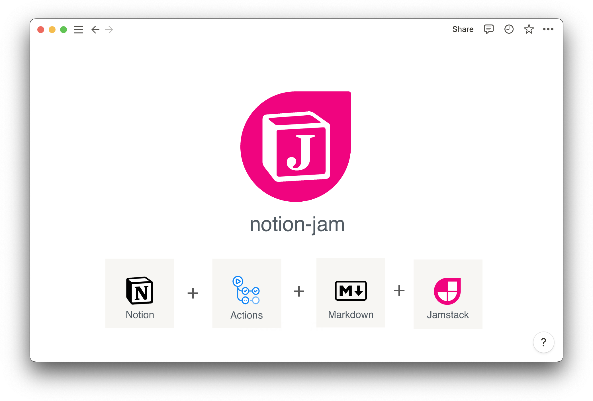

# notion-jam
<!-- badge -->
[](https://github.com/marketplace/actions/notion-jam)
[](https://www.npmjs.com/package/notion-jam)
[](https://www.npmjs.com/package/notion-jam)
[](https://www.codefactor.io/repository/github/victornpb/notion-jam)
[](package.json)
[](LICENSE)
<!-- endbadge -->


**Sync pages from Notion to GitHub to be used as a static website ([JAM][jamstack])**

- Notion pages are converted to markdown files.
- Database properties are automatically added as yaml frontmatter
- All images are downloaded locally and path rewritten to relative paths
- Page cover is downloaded
- Thumbnail property is added automatically to the frontmatter using page cover, first image, icon, or image number (configured by post)
---

## Usage

### Quick Start

1. Create a new Notion Integration
    
    

    
2. Add Notion secret to GitHub repository
    1. Go to `github.com/{user}/{repo}/settings/secrets/actions`
    2. Set `NOTION_SECRET` of Notion to your repository secret.
        
        
    
3. Share the Database with the integration
    
    
    
4. Create a workflow in `.github/workflows/**.yml` of your repository
    
    ### Example Workflow
    
    ```yaml
    # This is a basic workflow to help you get started with Actions
    
    name: NotionJAM
    
    # Controls when the workflow will run
    on:
      schedule:
        - cron: "0 21 * * *" # daily
      push:
        branches: [master, main]
    
      # Allows you to run this workflow manually from the Actions tab
      workflow_dispatch:
    
    # A workflow run is made up of one or more jobs that can run sequentially or in parallel
    jobs:
      # This workflow contains a single job called "build"
      build:
        # The type of runner that the job will run on
        runs-on: ubuntu-latest
    
        # Steps represent a sequence of tasks that will be executed as part of the job
        steps:
          # Checks-out your repository under $GITHUB_WORKSPACE, so your job can access it
          - uses: actions/checkout@v3
    
          - name: notion-jam
            uses: victornpb/notion-jam@v0.0.10
            with:
              NOTION_SECRET: ${{ secrets.NOTION_SECRET }}
              NOTION_DATABASE: https://www.notion.so/9e34cee9f5bd4c4aaf0d2eaf73ead47b
              FILTER_PROP: Status
              FILTER_VALUES: Published
              CONVERT_PROP_CASE: snake
              ARTICLE_PATH: content/posts/{title}/README.md
              ASSETS_PATH: ./
              PARALLEL_PAGES: 25
              PARALLEL_DOWNLOADS_PER_PAGE: 3
              DOWNLOAD_IMAGE_TIMEOUT: 30
              SKIP_DOWNLOADED_IMAGES: true
              DOWNLOAD_FRONTMATTER_IMAGES: true
          
          - name: Save changes
            uses: stefanzweifel/git-auto-commit-action@v4
            with:
              commit_message: Commit changes
    ```
    

## Configuration

### Parameters

| Name | Description | Required | Default |
| --- | --- | --- | --- |
| NOTION_SECRET | Notion API Token secret | ✅ |  |
| NOTION_DATABASE | Notion Database URL or ID (example: https://notion.so/00112233445566778899aabbccddeeff) | ✅ |  |
| FILTER_PROP | Property on the database used to query pages |  | Status |
| FILTER_VALUES | Return pages with the FILTER_PROP is equal this list of values |  | Ready,Published |
| CONVERT_PROP_CASE | Convert the database property names before adding to the frontmatter (camel,pascal,kebab,snake,none) |  | snake |
| ARTICLE_PATH | Path template to where to save markdown files |  | posts/{title}/README.md |
| ASSETS_PATH | Path to save images, if started with . will be relative to ARTICLE_PATH, otherwise absolute |  | ./ |
| PARALLEL_PAGES | Fetch this amount of pages in parallel |  | 25 |
| PARALLEL_DOWNLOADS_PER_PAGE | Number of images to download in parallel for each page |  | 3 |
| DOWNLOAD_IMAGE_TIMEOUT | Timeout in seconds for each image download |  | 30 |
| SKIP_DOWNLOADED_IMAGES | Skip downloading images if they already exist in the path |  | true |
| DOWNLOAD_FRONTMATTER_IMAGES | Downloads image urls in the frontmatter |  | true |


  [jamstack]: https://jamstack.org/what-is-jamstack/
